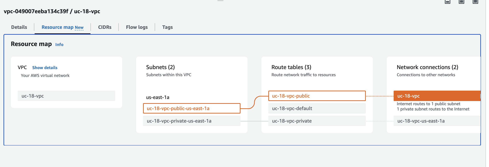

## Use case #18 - Use Infrastructure as Code (IaC) concept to provision infrastructure to consistently manage, track and scale cloud resources
### Acceptance criteria, use-case artifacts
1. A modular approach is used.   
2. One cloud virtual network is provisioned.   
3. Two subnets (public and private) are provisioned using for_each meta-argument.      
4. Two identical virtual machines are provisioned using for_each meta-argument.
5. The virtual machines are in the cloud virtual network, one in a private subnet and another in a public subnet.   
6. Terraform modules are published to GitHub.
7. Terraform remote state is used with the selected Cloud applicable backend.   
8. Terraform and provider versions requirements and limits are properly incorporated.  
